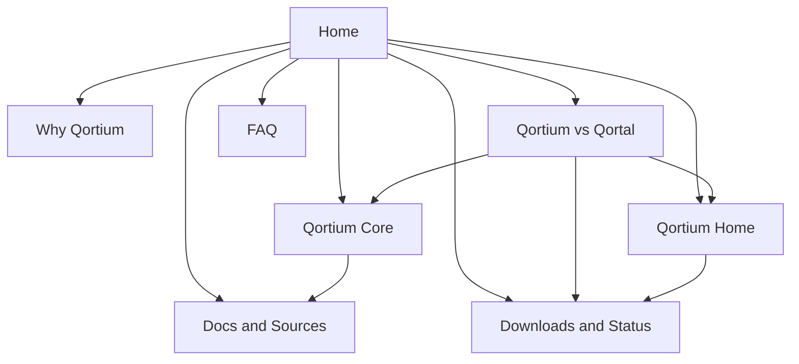
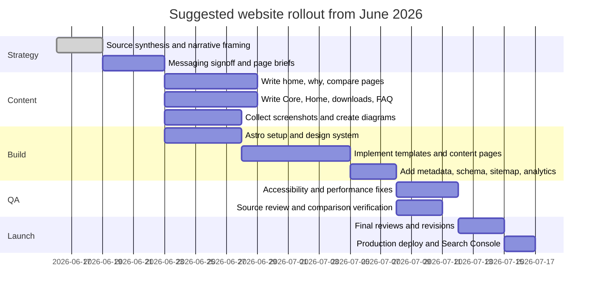

# Qortium Promotional Website Design Plan

## Executive summary

The strongest evidence from the public repositories is that **Qortium is best presented as a focused, technically serious fork and experimentation platform**, not as a mass-market replacement product launch. `qortium-core` explicitly describes itself as a “stripped-down and cleaned-up fork of Qortal Core” aimed at reducing inherited complexity and project-specific assumptions, while `qortium-home` presents itself as an early preview desktop and Android app for wallet management, node status, and QDN browsing. Just as important, Qortium Home warns that wallet and signing flows have **not** had a production security review and says users should **not** use wallets with meaningful funds yet. That combination should drive the website strategy: transparent, analytical, builder-first, and careful about maturity claims. citeturn7view0turn4view1turn4view2turn4view4

The best promotional angle is not “Qortal, but better.” The better angle is: **a cleaner baseline, a narrower scope, and a more explicit roadmap**. Qortium’s repos foreground a plain-language changelog, chain-builder documentation, a lite-node plan, an account-trust network, preview releases, and a focused browser-like QDN interface. Qortal’s current public messaging, by contrast, emphasizes a broader ecosystem story: rebuilding the internet, a native QORT economy, onboarding tools, hosted access, Qortal Hub as the primary interface, and Reticulum-powered voice/chat features. Those are overlapping but clearly different narratives, and the site should explain that difference directly rather than implying simple superiority. citeturn23view0turn26view0turn26view1turn12view6turn12view0turn12view2

The website should therefore target **five audiences** in descending priority: technically experienced Qortal users who want to understand the fork; QDN app developers; chain builders and open-source contributors; preview testers; and curious observers who need a concise, sourced explanation. The primary conversion should be **understanding and qualified interest**, not aggressive download conversion. Concretely, the main CTA should point to a comparison page and repository/docs first, with preview downloads as the secondary CTA. That recommendation follows directly from the repo status language, the preview-only release cadence, and the amount of still-unspecified governance, branding, and launch detail. citeturn18view0turn19view0turn20view0turn21view1turn29view1

My implementation recommendation is a **content-first static site** built with **Astro + Markdown/MDX content collections + optional small React islands**, deployed from GitHub to **Cloudflare Pages** or **Vercel**. Astro is well-suited to structured content and can stay static by default, while Cloudflare Pages and Vercel both support GitHub-connected automatic deployments and preview environments. GitHub Pages is a workable low-complexity fallback, but I would not choose it first unless zero operational overhead matters more than preview workflows and flexibility. citeturn34search0turn34search1turn34search2turn34search6turn34search14

## Research-based positioning

Qortium’s public material signals a different posture from Qortal in three ways. First, Qortium Core frames itself as a fork cleanup effort with a strong documentation habit and chain-builder orientation, not just a consumer blockchain product. Second, Qortium Home intentionally scopes itself to account management, node management, QDN browsing, and browser-like tabs, while explicitly placing bigger social or portal-style ambitions out of scope for the initial direction. Third, several Qortium roadmap items point toward foundational system design work, including lite nodes, trust-tier minting, on-chain chain parameters, bootstrap-friendly governance, and QDN-based auto-update flows. citeturn7view0turn8view4turn10view0turn26view0turn26view1turn26view2turn26view3

Qortal’s public material, by contrast, still leads with a broader, more maximalist platform narrative. The official site describes Qortal as a completely unique blockchain-based infrastructure platform capable of rebuilding the internet and establishing a worldwide economic system based on individual input, while the public wiki and Hub repo emphasize hosted access, onboarding, Qortal Hub as the primary interface, wallet/chat/publishing workflows, and newer Reticulum-based communication features. That matters because a Qortium site should **deliberately avoid** sounding like a smaller copy of those claims. It should sound more precise, more technical, and more candid. citeturn12view6turn12view4turn12view0turn12view2

A particularly interesting signal is that Qortium Home’s latest preview notes say desktop and Android QDN apps can read **Qortal** QDN data from a public Qortal node. That suggests the website should not narrate the project as a total severing from Qortal, but as a fork with overlapping ancestry, selective interoperability, and a different design direction. In practice, that means the comparison page should lead with **“different goals and tradeoffs”** rather than **“replacement”** language. citeturn21view1

### Site goals and target audiences

The website should have four concrete goals. It should explain what Qortium is in one screenful; document why it exists and how it differs from Qortal; give technically credible reasons to follow or test the project; and route visitors either to docs/repos or to preview downloads without overstating production readiness. Those goals fit the repos’ current maturity and the project’s documentation-heavy public footprint. citeturn7view0turn4view1turn8view4turn23view0

| Audience | What they care about | What the site should tell them | Primary CTA |
|---|---|---|---|
| Experienced Qortal users | Why the fork exists, what changed, whether it is compatible | “Qortium is a cleaner, narrower baseline with explicit design departures and preview-first releases.” | Read the comparison |
| QDN app developers | App rendering, request bridge, APIs, preview workflows | “Qortium Home is building a focused QDN-native browser shell with approval-gated account actions.” | Explore Qortium Home |
| Chain builders and core contributors | Governance, baseline assumptions, lite nodes, trust model | “Qortium is documenting a builder-facing chain foundation, not just shipping a wallet app.” | Explore qortium-core docs |
| Preview testers | What works today, what is risky, where to download | “Preview builds exist, but Home is not security-reviewed for meaningful funds.” | Download preview releases |
| Journalists / curious observers | Short, accurate framing | “Forked ancestry, narrower scope, documented differences, still in preview.” | Read the executive explainer |

### Key messages and reasons for interest

The most credible reasons a visitor might care about Qortium right now are shown below.

| Reason for interest | Evidence from sources | Messaging angle for the site |
|---|---|---|
| Cleaner baseline for builders | Qortium Core says it is a stripped-down, cleaned-up fork intended to reduce inherited complexity and project-specific assumptions. citeturn7view0 | “A chain foundation designed to be easier to understand, adapt, and build on.” |
| Focused QDN-native UX | Qortium Home is scoped around wallets, node status, QDN browsing, browser-style tabs, and account-aware flows. citeturn4view1turn4view2turn8view4turn9view1 | “A narrower, cleaner front end for wallets, nodes, and QDN.” |
| Documented design rigor | Both repos maintain plain-language changelogs; core docs include chain-builder, trust, lite-node, and upstream comparison documents. citeturn7view0turn8view0turn23view0 | “The roadmap is written down, not hand-waved.” |
| Governance and anti-farm experimentation | Qortium documents an on-chain account-trust network and Aura-style trust-tier minting notes. citeturn26view1turn26view2 | “Exploring governance and participation models beyond inherited assumptions.” |
| Lite-node direction | Qortium has a dedicated lite-node plan aimed at peer-backed, non-server-dependent data access. citeturn26view0 | “Looking beyond full-node-only participation.” |
| Interoperability signal | Qortium Home preview notes say it can read Qortal QDN data from a public Qortal node. citeturn21view1 | “Not just divergence—also pragmatic interoperability.” |

## Content architecture and copy recommendations

The site structure should bias toward fast comprehension. A visitor should be able to answer four questions quickly: **What is Qortium? Why does it exist? How is it different from Qortal? What can I do with it today?** That means the home page should not try to carry the entire explanation. It should summarize the case, then route readers into a dedicated comparison page, product pages for Core and Home, and a status/downloads page. That structure also aligns with Google’s preference for clear titles, headings, descriptive snippets, and canonical page intent. citeturn32search0turn32search4turn33search7

### Suggested sitemap

| Page | Purpose | Primary CTA | Estimated word count |
|---|---|---:|---:|
| Home | Explain Qortium in plain English, establish position, route to proof | Read the differences | 900–1,200 |
| Why Qortium | Explain fork rationale, design principles, reasons for interest | Explore the docs | 900–1,100 |
| Qortium vs Qortal | Side-by-side comparison with citations and caveats | View source evidence | 1,400–1,900 |
| Qortium Core | Explain the chain layer, trust/lite-node/auto-update directions | Open qortium-core | 900–1,200 |
| Qortium Home | Explain the app, current features, preview caveats, platforms | Download preview | 1,000–1,300 |
| Downloads and Status | Current preview versions, platform assets, maturity notices | Download latest preview | 600–900 |
| Docs and Sources | Curated source list, key repo links, release notes, docs index | Open source repos | 500–800 |
| FAQ | Answer high-friction questions and reduce misunderstanding | Read status notes | 800–1,100 |

### Recommended homepage structure

The homepage should use this narrative order:

1. **Hero**: what it is, in one sentence.  
2. **Short evidence block**: fork ancestry, cleanup goal, focused UI, preview status.  
3. **Why it exists**: three or four reasons the project is interesting.  
4. **Compare section teaser**: clear route to Qortium vs Qortal.  
5. **Product split**: Qortium Core and Qortium Home as separate but related surfaces.  
6. **Status block**: preview maturity, no-security-review notice for Home, current release tags.  
7. **Docs/source credibility block**: changelogs, docs, repos, release notes.  
8. **Final CTA**: compare, read docs, or download preview. citeturn7view0turn4view1turn4view4turn18view0turn19view0

### Suggested hero copy

**Recommended primary hero**

**Headline:**  
**A cleaner chain baseline with a focused QDN home**

**Subhead:**  
Qortium is a stripped-down fork of Qortal Core with a companion app for wallets, nodes, and QDN browsing. It is built for preview testing, chain experimentation, and a more explicit roadmap. citeturn7view0turn4view1turn8view4

**Primary CTA:**  
Read the differences

**Secondary CTA:**  
Try the preview releases

**Alternative hero for a more technical audience**

**Headline:**  
**Fork less mythology, keep more signal**

**Subhead:**  
Qortium keeps the parts of the Qortal codebase that are useful as a starting foundation while removing inherited assumptions, narrowing scope, and documenting the redesign in plain language. citeturn7view0turn23view0

**Alternative hero for former Qortal users**

**Headline:**  
**If you know Qortal, this will make immediate sense**

**Subhead:**  
Qortium shares ancestry with Qortal, but it is taking a different path: a cleaned-up core, a narrower home app, preview-first iteration, and clearer documentation of technical and governance choices. citeturn7view0turn4view1turn23view0turn31view2

### Suggested feature descriptions

| Feature | Suggested copy |
|---|---|
| Cleaner core baseline | Qortium Core starts from Qortal ancestry, then removes inherited assumptions that are not necessary for a fresh chain baseline. The public changelog repeatedly documents neutralization of Qortal-specific naming, cleanup of historical triggers, and a builder-facing documentation set. citeturn22view0turn22view4turn30view0turn30view1 |
| Focused QDN interface | Qortium Home is not trying to be a giant portal. It is a browser-like shell for wallets, node status, QDN apps/websites/media, and account-aware tabs. The project plan explicitly keeps broad portal/social scope out of the first direction. citeturn4view1turn4view2turn9view0turn10view0 |
| Preview-friendly testing flows | Current Core and Home releases are preview prereleases, and Home can manage a local Previewnet Core install, install Java 17 when needed, and preview local QDN content on desktop and Android. citeturn17view1turn20view0turn21view1 |
| Trust-network experimentation | Qortium documents an on-chain account trust network and trust-tier minting direction intended to reduce farm-account influence without biometric or centralized identity checks. citeturn26view1turn26view2 |
| Lite-node roadmap | Qortium has a written lite-node plan aimed at connecting to ordinary peers for derived data instead of relying on separate lite servers, while clearly admitting current limitations. citeturn26view0 |
| Transparent project history | Both major repos maintain human-readable changelogs aimed at non-developers first. That is unusual and should be used as a credibility asset on the site. citeturn7view0turn8view0 |

### FAQ topics to include

Use these as FAQ headings:

- What is Qortium?
- Is Qortium a fork of Qortal?
- Why split from Qortal at all?
- Is Qortium trying to replace Qortal?
- What does Qortium Home do today?
- Is Qortium Home safe for real funds?
- What is Previewnet?
- How does Qortium differ from Qortal Hub?
- Can Qortium interact with Qortal QDN data?
- Does Qortium already have a native asset and mainnet economy?
- How do auto-updates work?
- What is the trust network?
- Is there a lite-node roadmap?
- What governance is documented publicly, and what is still unspecified?
- Where should I start: Core, Home, or docs?

## Qortium and Qortal compared

The comparison page is the load-bearing page on the whole site. It should say, plainly, that Qortium comes from Qortal ancestry but now pursues a different balance of scope, assumptions, and documentation. It should also avoid false certainty where sources are incomplete.

| Dimension | Qortium | Qortal | What the site should say |
|---|---|---|---|
| **Overall framing** | Working name for a stripped-down, cleaned-up fork of Qortal Core. citeturn7view0 | Publicly framed as a full decentralized infrastructure platform and economic system. citeturn12view6turn14view1 | “Qortium is not just another interface; it is a fork with a narrower philosophy.” |
| **Technical focus** | Reducing inherited complexity and project-specific assumptions; includes chain-builder docs, lite-node planning, trust-network docs, and upstream comparison notes. citeturn7view0turn23view0turn26view0turn26view1 | Public docs emphasize broad platform capabilities, Q-Apps, hosted access, and ecosystem breadth. citeturn12view6turn12view4turn12view2 | “Qortium is more builder-facing and systems-oriented in its current public materials.” |
| **UI scope** | Home is focused on wallets, node status, QDN browsing, browser-style tabs, and approval-gated actions; large portal/social scope is out of scope initially. citeturn4view1turn4view2turn10view0 | Hub is the primary interface and centers chat, wallet, publishing, hosted access, and Reticulum-based voice features. citeturn12view0turn28view2 | “Qortium Home is intentionally narrower than Qortal Hub.” |
| **Product maturity** | Home is in active early development and explicitly warns against using meaningful funds until broader review/testing. citeturn4view1turn4view4 | Hub is the current primary interface, with a latest release on June 14, 2026 and public downloads. citeturn15view4turn12view5 | “Qortium is a preview project; Qortal is presenting a more user-ready surface.” |
| **Hosted access** | No public hosted-access path was found in the Qortium repos; this appears **unspecified** in current public sources. citeturn4view1turn8view4 | Qortal Hub and Qortal Go offer hosted access, and the quick-start guide highlights it. citeturn12view0turn28view2turn12view2 | “Qortium should not promise instant try-in-browser access unless that is actually launched.” |
| **Auto-updates** | Auto-update is disabled by default and uses pinned QDN binary + on-chain manifest approval in a configured development group. citeturn26view3turn29view1 | Official wiki says Qortal auto-updates rely on on-chain developer approval and currently pull a signed `qortal.jar` from GitHub, with future QDN git planned. citeturn31view0 | “Qortium is already pushing toward a QDN-pinned update model and conservative default opt-in.” |
| **Governance posture** | Public sources show bootstrap-friendly null-owned public development/minting groups, configurable dev-group IDs, and on-chain chain-parameter updates; formal public admin roster/threshold is **not clearly specified** in the sources reviewed. citeturn30view1turn29view0turn29view1 | Qortal official sources document dev-group control, but official pages are internally inconsistent: one says 60% approval, another says 40% / 5 of 11 admins. citeturn31view0turn31view1turn31view2 | “Be careful and precise: Qortium has documented mechanics, but public governance details are still incomplete; Qortal has more public governance detail, though not perfectly consistent.” |
| **Native asset model** | Qortium introduces neutral `NATIVE` naming, removes the inherited QORT genesis asset from the main chain, and allows bootstrap without a pre-created native asset. citeturn30view0turn22view4 | Qortal publicly centers the QORT service coin and its network economy. citeturn12view4turn31view2 | “Qortium is separating chain baseline design from inherited QORT assumptions.” |
| **Participation / anti-Sybil direction** | Qortium adds an on-chain trust network and Aura-style trust tiers to reduce farm-account influence. citeturn26view1turn26view2 | Qortal public docs emphasize sponsorship into minting and blocks-minted / leveling as core participation mechanics. citeturn31view2 | “Qortium is experimenting more explicitly with anti-farm trust mechanics.” |
| **Roadmap emphasis** | Lite nodes, trust policies, chain-parameter governance, preview/mobile QDN workflows, and cleaner baseline behavior show up prominently. citeturn26view0turn26view1turn26view3turn20view0 | Qortal public roadmap themes include onboarding, hosted access, communications, Q-Apps, GitHub replacement, and broader platform usage. citeturn12view2turn31view0turn12view4 | “Qortium’s current public roadmap is more architectural than ecosystem-marketing-heavy.” |
| **Interface licensing** | Qortium Home is 0BSD. citeturn17view1turn27view0 | Qortal Hub is GPL-3.0. citeturn15view3turn28view2 | “If permissive UI licensing matters to contributors, that is worth mentioning.” |
| **Interoperability signal** | Latest Home preview notes say Qorium Home can read Qortal QDN data from a public Qortal node. citeturn21view1 | Qortal documents its own QDN and Hub surfaces, but does not frame that relationship from the Qortium side. citeturn13search5turn12view0 | “Frame the fork as divergence with selective interoperability, not a scorched-earth break.” |

## Visual direction, SEO, and measurement

### Recommended visuals, diagrams, and asset plan

The site should look more like a **developer product launch** than a generic crypto landing page. That means restrained typography, clean screenshots, minimal gradients, and diagrams that explain architecture and intent. The visual story should foreground **clarity, scope, and evidence**, not lifestyle imagery or giant abstract “future internet” claims. That tone better matches Qortium’s own changelogs and planning docs, and it differentiates the site from Qortal’s broader visionary marketing posture. citeturn7view0turn8view0turn12view6

| Asset | Purpose | How to create it | Where to host it |
|---|---|---|---|
| Home app hero screenshot | Immediate proof that Qortium Home exists and is focused | Capture a real release build showing dashboard + address bar + QDN explorer | Versioned in site repo under `/public/images/`; export AVIF/WebP |
| Core/Home architecture diagram | Explain relationship between Core, Home, QDN, previews, and releases | Hand-authored SVG from repo evidence | Site repo as inline SVG for crisp rendering |
| Qortium vs Qortal comparison graphic | Summarize scope differences visually | Hand-authored SVG matrix | Site repo |
| Trust-network explainer diagram | Turn abstract governance material into understandable model | Hand-authored SVG based on trust docs | Site repo |
| Release/status badges | Show current preview versions and platform availability | Pull from GitHub Releases during build or manually update Markdown | Site repo or build-time data fetch |
| Download assets | Actual platform binaries | Keep these on GitHub Releases rather than duplicating them on the promo site | GitHub Releases, linked from downloads page |

For downloads specifically, keep binaries on GitHub Releases because that is already how both Qortium repos distribute preview artifacts. The website should act as the explanatory and routing layer, not as a duplicate binary host. citeturn20view0turn21view1

### Suggested SEO keywords and page metadata

The SEO goal is not broad generic crypto traffic. It is high-intent discovery by people searching for Qortium itself, its relationship to Qortal, QDN browsing, preview releases, and the specific technical ideas Qortium is documenting. Google’s own guidance emphasizes descriptive title links, useful meta descriptions, canonicalization where needed, sitemaps, and structured data where relevant. citeturn32search0turn32search4turn33search7turn36search2turn38search4turn38search6

**Primary keyword set**

- qortium
- qortium core
- qortium home
- qortium vs qortal
- qortal fork
- qdn browser
- qdn app browser
- previewnet
- lite node blockchain
- account trust network
- decentralized app hosting
- qdn preview
- qortium preview release

Those keywords are justified by the language used throughout the repos and official Qortal material around QDN, Hub/Home, preview releases, trust, and platform scope. citeturn4view2turn26view0turn26view1turn12view0turn13search5

| Page | Target keyword focus | Suggested title tag | Suggested meta description |
|---|---|---|---|
| Home | qortium, qortium core, qortium home | **Qortium | A cleaner chain baseline and focused QDN home** | Qortium is a stripped-down fork of Qortal Core with a focused companion app for wallets, nodes, and QDN browsing. Explore the differences, docs, and preview releases. |
| Why Qortium | why qortium, qortal fork | **Why Qortium exists | Cleaner baseline, narrower scope** | Learn why Qortium forked from Qortal, what assumptions it changes, and why builders, QDN developers, and experienced users may care. |
| Compare | qortium vs qortal | **Qortium vs Qortal | Technical, UX, governance, and roadmap differences** | A sourced comparison of Qortium and Qortal across core design, interface scope, governance, auto-updates, participation models, and roadmap direction. |
| Qortium Core | qortium core, lite node, trust network | **Qortium Core | Fork cleanup, trust network, lite-node direction** | Explore Qortium Core, its builder-facing docs, trust-network model, lite-node plan, preview releases, and cleanup of inherited assumptions. |
| Qortium Home | qortium home, qdn browser | **Qortium Home | Wallets, nodes, and QDN browsing in preview** | Qortium Home is a focused desktop and Android app for wallets, node status, QDN browsing, and account-aware tabs. Preview status and security caveats included. |
| Downloads | qortium download, qortium preview | **Qortium downloads | Current preview releases and status** | Download current Qortium Core and Qortium Home preview releases, check supported platforms, and review maturity notes before testing. |

**Meta and structured-data checklist**

Use these on launch:

- unique `<title>` and `<meta name="description">` on every page; Google can use them as title-link and snippet inputs. citeturn32search0turn32search4
- canonical URLs on all pages. citeturn33search7
- Open Graph tags (`og:title`, `og:description`, `og:image`, `og:url`) for share previews. citeturn33search2turn33search18
- XML sitemap and Search Console submission. citeturn36search2turn36search8turn36search12
- JSON-LD for `Organization` on the site as a whole, `SoftwareApplication` on Core/Home/download pages, and `BreadcrumbList` where appropriate. citeturn38search0turn38search1turn38search4turn38search9

### Analytics and tracking recommendations

For this project, I would use **Plausible as the default analytics layer** and add **GA4 only if a later growth program genuinely needs it**. Plausible’s documentation emphasizes lightweight, privacy-friendly analytics without cookies or personal-data collection, which is a much better fit for a project whose public ethos leans toward user control and reduced centralization. If GA4 is added later, Google recommends using recommended events where possible, custom events only when necessary, UTM parameters for campaign attribution, and consent mode when user consent management is required. citeturn32search7turn32search3turn33search0turn33search15turn36search0turn33search16

**Recommended event map**

| Event | Why it matters | Tooling recommendation |
|---|---|---|
| `compare_open` | Measures whether the core narrative is working | Plausible custom goal or GA4 custom event |
| `download_click` | Measures preview intent by product/platform | Plausible custom event with props, or GA4 custom event |
| `repo_click` | Measures contributor/developer interest | Same |
| `docs_click` | Measures research/credibility engagement | Same |
| `faq_expand` | Shows friction points and confusion areas | Same |
| `status_notice_view` | Confirms visitors saw maturity/security caveats | Same |
| `newsletter_signup` or `release_updates_signup` | Only if you add an update channel | GA4 recommended `sign_up` can fit if a real account/update signup exists; otherwise use a custom event. citeturn33search0turn36search1 |

Do **not** over-instrument. The project is early, and a small, high-signal event map is more useful than a huge analytics taxonomy.

## Technical delivery and rollout

### Recommended stack and deployment options

The best fit is:

- **Framework:** Astro
- **Content:** Markdown/MDX via Astro content collections
- **Interactive parts:** small React islands only where needed
- **Hosting:** Cloudflare Pages or Vercel
- **Editing model:** Git-based by default; add Decap CMS only if non-developers need editorial access
- **Downloads:** GitHub Releases
- **CI/CD:** GitHub Actions for lint/build/link-check/Lighthouse smoke test

This recommendation is driven by a content-heavy site with a few interactive areas, not a web app. Astro’s content collections are well-suited for structured content, and Astro can deploy statically to Vercel. Cloudflare Pages and Vercel both support Git-based automatic deployments. If an editorial UI is later needed, Decap CMS is Git-based and designed for static-site workflows, while Astro documents CMS integration paths generally. citeturn34search0turn34search1turn34search2turn34search6turn35search3turn35search4

**My choice:** Astro + MDX + React islands on **Cloudflare Pages**.  
Why: it keeps the site fast and content-first, supports good GitHub-based preview deployments, and does not overcomplicate a brand/product site that mostly needs prose, tables, diagrams, and a small status feed. citeturn34search2turn34search9

**Fallback options**

| Option | When to choose it | Tradeoffs |
|---|---|---|
| Astro + Cloudflare Pages | Best overall fit | Slightly more setup than ultra-basic hosting |
| Astro + Vercel | If team already uses Vercel | Great DX, but slightly more platform gravity |
| Plain React/Vite static build | If you want maximum familiarity with Qortium Home’s frontend stack | Easier reuse, worse content ergonomics than Astro |
| Astro + Decap CMS | If non-technical editors will update content often | Adds editorial/auth complexity |
| GitHub Pages | If almost-zero hosting complexity matters most | Less flexible preview/deployment workflow |

### Performance and accessibility best practices

The site should set explicit performance and accessibility standards from day one. At minimum, build toward good Core Web Vitals, especially LCP, INP, and CLS; preload the hero image and any critical web font used in the LCP path; lazy-load below-the-fold imagery; provide width and height on images to avoid layout shift; and keep JavaScript light so interactivity remains responsive. For accessibility, target WCAG 2.2 AA as the baseline, with keyboard reachability, visible focus states, sufficient contrast, descriptive link text, reduced-motion respect, and alt text on meaningful images. citeturn32search1turn32search5turn37search0turn37search1turn37search2turn37search3turn37search6turn37search7turn32search2turn32search6

### Timeline and phased deliverables

### Prioritized implementation tasks and effort

| Priority | Task | Why it matters | Effort |
|---|---|---|---|
| High | Write the comparison page first | This is the page that will anchor credibility and reduce confusion | High |
| High | Capture real Qortium Home screenshots | Prevents the site from feeling speculative | Medium |
| High | Draft transparent maturity/status notices | Avoids misleading users about Home security and preview readiness | Low |
| High | Build home page + Core/Home product pages | Establishes clear architecture and product split | High |
| High | Implement downloads/status page linked to GitHub Releases | Converts interest into qualified testing | Medium |
| High | Add canonical tags, sitemap, Open Graph, JSON-LD | Needed for discoverability and professional launch hygiene | Medium |
| Medium | Create trust-network and architecture diagrams | Makes complex design choices legible | Medium |
| Medium | Add Plausible or equivalent privacy-first analytics | Lets you measure whether the narrative works | Low |
| Medium | Add FAQ from real friction points | Reduces repeated explanatory burden | Low |
| Medium | Add docs/sources page | Reinforces rigor and gives journalists/devs a citation trail | Low |
| Low | Add light CMS/editorial workflow | Useful only if non-dev contributors will update content often | Medium |
| Low | Add blog/news section | Valuable later, not essential to launch | Medium |

## Open questions and limitations

A few important items were **not clearly specified** in the sources reviewed and should be treated as open until Qortium publishes them explicitly:

- a formal public Qortium governance page listing development-group composition, approval thresholds, and update authority details;
- final mainnet/stable launch plans, if any, beyond current previewnet-facing materials;
- explicit long-term token/economic branding beyond the current neutral `NATIVE` direction in Core cleanup work;
- production security-review status for Home beyond the current warning that it should not be used with meaningful funds yet;
- hosted-access plans, if any, for Qortium itself;
- official brand guidelines, logos, or design assets suitable for a public website. citeturn4view1turn26view3turn30view0turn30view1
(Note: we do have a logo/icon we can use for Qortium Core and Home in their respective app repos.)

One important source-quality note: Qortal’s own official materials appear inconsistent about its developer approval threshold for updates. One official wiki page says 60% of the developer group must sign, while the leadership page says 40% and currently 5 of 11 admins. A Qortium comparison page should mention this carefully if governance precision matters, or else avoid overfocusing on exact thresholds when summarizing Qortal at a high level. citeturn31view0turn31view1turn31view2
(Note: this can be checked online live against the local or public API and verified in the dev group data - group id 1 on both chains)

## Primary sources and links

The following are the most important source documents for the website project:

| Source | Why it matters |
|---|---|
| `qortium-core` main changelog citeturn7view0 | Best single source for Qortium Core’s philosophy, cleanup direction, and current technical changes |
| `qortium-home` README citeturn4view1turn4view2turn4view4 | Best summary of shipped Home features, planned work, and maturity caveats |
| `qortium-home` project plan citeturn8view4turn9view1turn10view0 | Best source for intended scope, stack, out-of-scope items, and UX direction |
| Qortium Core preview release notes citeturn20view0 | Best current source for active preview release framing |
| Qortium Home preview release notes citeturn21view1 | Current status and recent headline features |
| Qortium docs index citeturn23view0 | Useful map of trust/lite-node/upstream docs |
| Qortium lite-node plan citeturn26view0 | Key roadmap differentiator |
| Qortium account trust network docs citeturn26view1turn26view2 | Key governance/participation differentiator |
| Qortal Core README/repo page citeturn14view1turn12view1 | Best primary source for Qortal Core framing |
| Qortal Hub README/repo page citeturn12view0turn28view2 | Best primary source for current Qortal UI framing |
| Qortal official site and quick-start/wiki pages citeturn12view6turn12view2turn12view4 | Best sources for broad project positioning and onboarding |
| Qortal governance/update docs citeturn31view0turn31view1turn31view2 | Necessary for governance comparison |
| Google Search Central docs citeturn32search0turn32search4turn33search7turn36search2turn38search0turn38search1 | Basis for title/meta/canonical/sitemap/structured-data recommendations |
| W3C + web.dev performance/accessibility docs citeturn32search2turn32search6turn32search1turn37search0turn37search2turn37search3 | Basis for accessibility and Core Web Vitals recommendations |
| Astro / hosting docs citeturn34search0turn34search1turn34search2turn35search3turn35search4 | Basis for the recommended stack and deployment model |
| Plausible / GA4 docs citeturn32search7turn33search0turn33search15turn36search0 | Basis for analytics recommendations |

(Note: we should have most of these repos locally, and others, in the ~/git folder)
